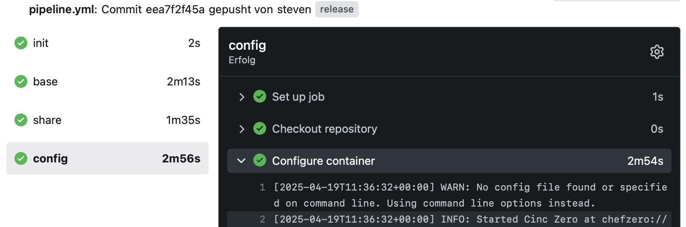

# Proxmox CI: Container Automation

## Overview

Proxmox CI implements a self-contained, extensible CI/CD environment for provisioning, configuring, and orchestrating Linux Containers (LXC) within Proxmox VE. Leveraging an Infrastructure-as-Code (IaC) approach, it manages the entire container lifecycle—bootstrapping, deployment, configuration, and verification—through version-controlled automation.

The system follows a multi-stage pipeline capable of recursively deploying and configuring itself. Initial bootstrapping is performed via a local Docker environment, with subsequent deployments targeting Proxmox VE. This approach ensures consistent, reproducible, and automated infrastructure management.

## Architecture

The architecture is based on a self-replicating pipeline.

<p align="center">
  
</p>

### Provisioning & Configuration
- Ansible (`base/default.yml`) interacts with the Proxmox API using the `community.general.proxmox` collection to create containers using reproducible configuration via the `base/roles/base` role and installs configuration management.
- Chef/Cinc (code in `config/` and `share/`) is executed inside the container to manage application-level configuration.

### Self-Replication
- During configuration, the codebase is pushed into a Gitea instance running inside the container.
- This triggers the same pipeline from within the new environment, enabling recursive configuration ("pipeline within a pipeline").
- Subsequent runs are idempotent: Ansible and Chef validate and enforce the desired state using a static configuration.

### Pipeline Workflow

<p align="center">
  
</p>

Stages include:

- **`base` Job**
    - Triggered on `release` branch pushes.
    - Uses a composite action (`srv/base/.gitea/workflows@main`) to check out the provisioning repository and run Ansible for container setup.

- **`config` (and `share`) Jobs**
    - Copy project files into the container and execute Chef/Cinc in local mode to configure the system.

## Core Concepts

- **Self-Managed Infrastructure:** The system provisions, configures, and verifies itself recursively via the pipeline.

- **Container Provisioning:** Managed by Ansible playbooks and roles using the Proxmox API for lifecycle management and base setup.

- **Container Configuration:** Managed by Chef/Cinc cookbooks executed via `cinc-client` in local mode. Configuration is parameterized using environment variables and Chef attributes.

- **Modularity:** Distinct components and modular reusable workflows managed within Gitea, facilitating extension.

- **Environment Management:** Secrets and environment variables are initially loaded from config.json during local bootstrapping and automatically propagated into the CI system.

- **CI/CD Orchestration:** Defined in `.gitea/workflows/pipeline.yml` using Gitea Actions syntax. Execution is handled by a Gitea Runner installed inside the container.

- **Network Share:** Configured for integration purposes.

## Project Structure
```
.
├── .gitea/workflows/       # Pipeline definitions
├── base/                   # Base container
│   ├── .gitea/workflows/
│   ├── roles/base/
│   └── default.yml
├── config/                 # Container configuration
│   ├── attributes/
│   ├── libraries/
│   ├── recipes/
│   └── templates/
├── run/                    # Local development and bootstrapping
│   ├── Dockerfile
│   ├── config.json         # Deployment configuration template
│   └── build.sh
├── share/                  # Shared integration resources
│   ├── attributes/
│   ├── recipes/
│   └── templates/
└── config.env              # Environment configuration
```
---

This repository provides a reproducible and modular automation pattern for managing containerized environments in Proxmox VE. 

The approach emphasizes declarative configuration, automated validation, and recursive self-management.

