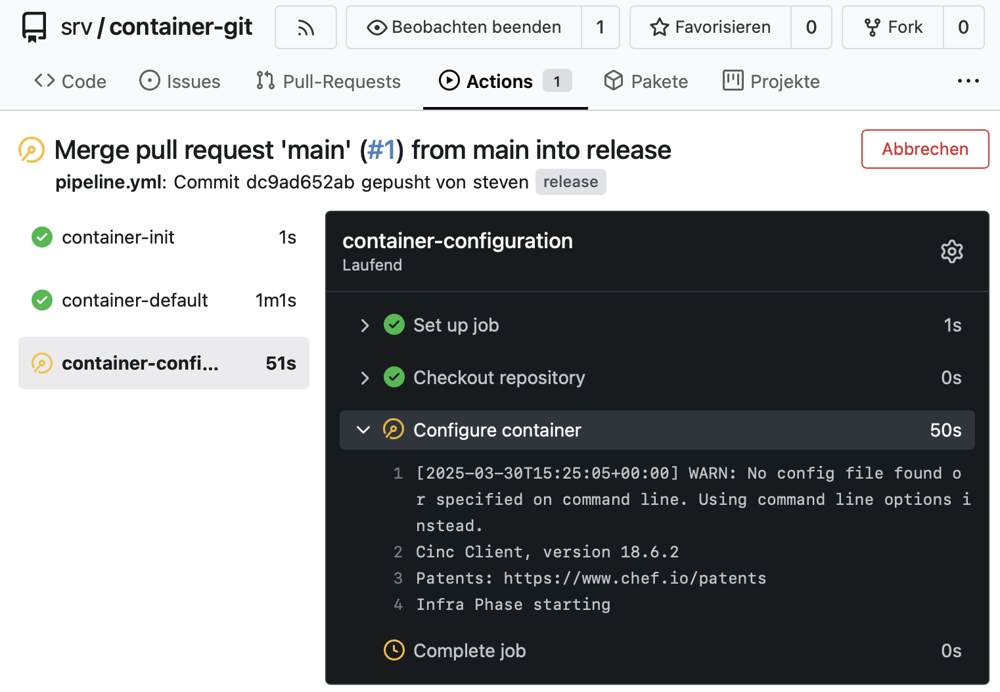

# Proxmox CI: Self-Configuring CI Environment for LXC Container Automation

## Overview

Proxmox CI is an automation framework designed for provisioning and managing Linux Containers (LXC) in Proxmox environments. It integrates infrastructure provisioning with configuration management to ensure consistent, reproducible, and idempotent container deployments.

## Components

- **Infrastructure Provisioning:**  
  Automates the creation and lifecycle management of LXC containers within Proxmox, ensuring uniformity in infrastructure definitions and deployment.

- **Configuration Management:**  
  Applies structured configuration management methods to consistently configure container environments, promoting reproducibility and standardization.

- **Idempotent Deployment Process:**  
  Ensures repeated executions consistently achieve the same system state. By assigning fixed container identifiers and deploying uniform repository structures, the system autonomously builds, validates, and restores its configurations, enhancing operational reliability.
